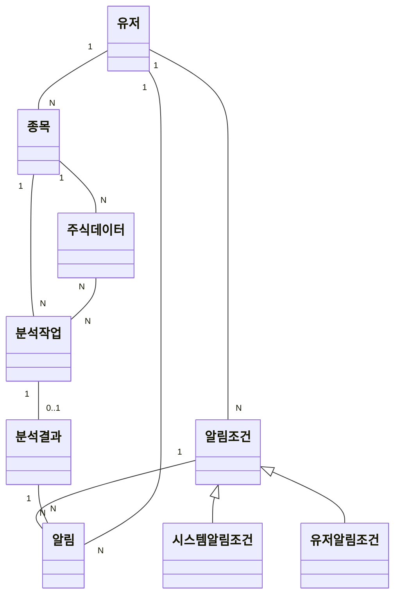

# 도메인 모델 수정안

## 도메인 모델

```mermaid
classDiagram
    class 유저
    class 종목
    class 주식데이터
    class 분석작업
    class 분석결과
    class 알림조건
    class 시스템알림조건
    class 유저알림조건
    class 알림

    유저 "1" -- "N" 종목
    종목 "1" -- "N" 주식데이터
    종목 "1" -- "N" 분석작업
    주식데이터 "N" -- "N" 분석작업
    분석작업 "1" -- "0..1" 분석결과
    유저 "1" -- "N" 알림조건
    알림조건 <|-- 시스템알림조건
    알림조건 <|-- 유저알림조건
    알림조건 "1" -- "N" 알림
    분석결과 "1" -- "N" 알림
    유저 "1" -- "N" 알림
```

## 도메인 모델 요소

- 유저
- 종목
- 주식데이터
- 분석작업
- 분석결과
- 알림조건
- 시스템알림조건
- 유저알림조건
- 알림
