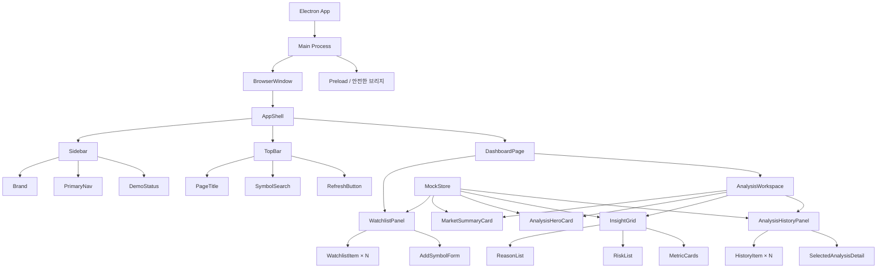
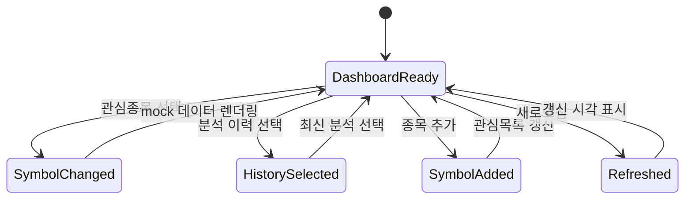

# Stock Agent Electron UI 설계안

## 1. 목적

Stock Agent의 핵심 사용자 흐름을 데스크톱 화면으로 검증하기 위한 Electron 데모를 정의한다. 이 단계에서는 FastAPI, SQLite, Gemini, yfinance, 카카오 API와 연결하지 않고 고정된 mock 데이터와 화면 상태만 사용한다.

## 2. 화면 원칙

- 한 화면에서 관심종목, 최신 분석, 분석 이력을 함께 확인한다.
- 투자 판단을 대신하지 않는 분석 보조 도구임을 명확하게 표시한다.
- 종목 상태는 색상뿐 아니라 텍스트 배지로도 구분한다.
- 실제 연동 전 단계이므로 `DEMO DATA`와 마지막 갱신 시각을 항상 표시한다.
- 1280 x 800 데스크톱을 기준으로 하되 920px 이하에서는 1열로 재배치한다.

## 3. 정보 구조

| 영역 | 역할 | 주요 내용 |
| --- | --- | --- |
| App Shell | 전체 레이아웃 | 사이드바, 상단바, 콘텐츠 영역 |
| Watchlist | 분석 대상 선택 | 종목 목록, 등락률, 종목 추가 |
| Market Summary | 선택 종목 요약 | 현재가, 등락, 거래량, 갱신 상태 |
| Analysis Hero | 최신 AI 분석 | 종합 판단, 요약, 신뢰 안내 |
| Insight Grid | 근거와 위험 | 핵심 근거, 위험 요인, 주요 지표 |
| History Panel | 과거 분석 비교 | 분석 시점 목록, 선택 시 상세 교체 |
| Demo Notice | 비연동 상태 고지 | mock 데이터 및 API 미연결 안내 |

## 4. UI 컴포넌트 다이어그램

## 5. 컴포넌트 책임

| 컴포넌트 | 입력 | 사용자 동작 | 상태 변화 |
| --- | --- | --- | --- |
| `SymbolSearch` | 종목 코드 또는 이름 | 검색 제출 | mock 목록에서 종목 선택 |
| `WatchlistItem` | 종목, 현재가, 등락률 | 행 클릭 | 전체 분석 영역 갱신 |
| `AddSymbolForm` | 사용자 입력 | 추가 버튼 | 데모 종목을 관심목록에 추가 |
| `RefreshButton` | 현재 선택 종목 | 새로고침 | 갱신 시각 변경, 토스트 표시 |
| `AnalysisHeroCard` | 판단, 요약, 분석 시각 | 없음 | 선택된 이력에 따라 내용 교체 |
| `HistoryItem` | 과거 분석 요약 | 이력 클릭 | 해당 시점 상세 표시 |
| `PrimaryNav` | 메뉴 목록 | 메뉴 클릭 | 데모에서는 대시보드만 활성화, 나머지는 안내 토스트 |

## 6. 화면 상태

## 7. 비연동 범위

### 데모에서 동작

- 관심종목 선택 및 mock 분석 교체
- 종목 검색
- 데모 종목 추가
- 분석 이력 선택
- 새로고침 시각 및 토스트 표시
- 반응형 레이아웃

### 데모에서 동작하지 않음

- 실제 주가 조회와 차트 데이터 갱신
- Gemini 분석 요청
- 관심종목 DB 저장
- 카카오 로그인 및 알림 발송
- 백그라운드 스케줄러 실행

## 8. 향후 연결 지점

| UI 동작 | 연결 예정 API |
| --- | --- |
| 관심종목 조회 | `GET /watchlist` |
| 관심종목 추가 | `POST /watchlist` |
| 관심종목 삭제 | `DELETE /watchlist/{symbol}` |
| 최신 분석 조회 | `GET /stocks/{symbol}/analysis/latest` |
| 분석 이력 조회 | `GET /stocks/{symbol}/analysis` |
| 분석 상세 조회 | `GET /stocks/{symbol}/analysis/{id}` |
| 수동 분석 실행 | `POST /scheduler/run?force=true` |
