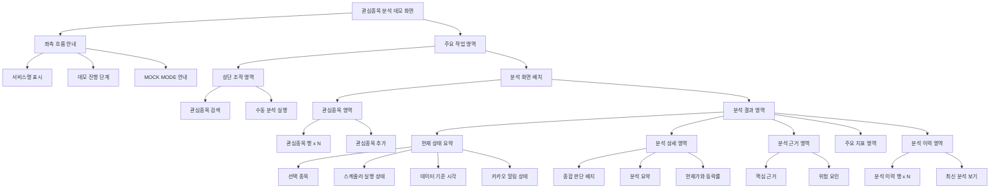
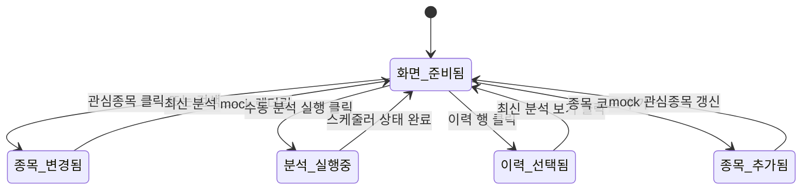

# Stock Agent Electron UI 설계안

## 1. 목적

Stock Agent의 현재 구현 기능을 데스크톱 화면에서 확인하기 위한 Electron 데모를 정의한다. 이 단계의 목표는 새 투자 기능을 제안하는 것이 아니라, 이미 구현된 FastAPI 기능을 연결했을 때 사용자가 어떤 흐름으로 사용할지 검증하는 것이다.

데모 앱은 아직 FastAPI, SQLite, Gemini, yfinance, 카카오 API와 연결하지 않는다. 대신 고정된 mock 데이터로 `관심종목 -> 최신 분석 -> 분석 이력 -> 알림 상태` 흐름만 표현한다.

## 2. Electron 선택 이유

Electron은 이번 단계에서 새 백엔드를 만들지 않고도 데스크톱 앱 사용성을 빠르게 검증할 수 있다는 점이 가장 크다. Stock Agent는 이미 FastAPI 중심으로 API 경계가 잡혀 있으므로, Electron 화면은 향후 `fetch` 호출만 연결해도 현재 API와 자연스럽게 붙일 수 있다.

또한 HTML, CSS, JavaScript를 그대로 사용하므로 기존 웹 화면과 UI 설계 자산을 재사용하기 쉽다. 패키징 단계에서는 Windows/macOS/Linux 데스크톱 배포를 같은 코드베이스에서 검토할 수 있고, Electron의 main process, preload, renderer 구조를 이용해 화면 코드와 로컬 앱 권한을 분리할 수 있다.

민감 정보는 Electron 앱에 직접 보관하지 않는 것을 원칙으로 한다. Gemini API 키, 카카오 토큰, DB 접근은 FastAPI 백엔드가 담당하고, Electron은 사용자가 보는 화면과 백엔드 API 호출만 맡는다.

## 3. 기능 범위 정리

### 현재 구현 기능 기준

| 기능 | 백엔드 구현 기준 | 데모 화면 표현 |
| --- | --- | --- |
| 관심종목 목록 | `GET /watchlist` | 좌측 관심종목 목록 |
| 관심종목 추가 | `POST /watchlist` | 종목 코드 입력 후 mock 항목 추가 |
| 관심종목 삭제 | `DELETE /watchlist/{symbol}` | 후속 화면 범위로 문서에만 표시 |
| 최신 분석 조회 | `GET /stocks/{symbol}/analysis/latest` | 선택 종목의 최신 분석 카드 |
| 분석 이력 조회 | `GET /stocks/{symbol}/analysis` | 하단 이력 테이블 |
| 분석 상세 조회 | `GET /stocks/{symbol}/analysis/{id}` | 이력 클릭 시 분석 카드 교체 |
| 수동 분석 실행 | `POST /scheduler/run?force=true` | 상단 `수동 분석 실행` 버튼 |
| 카카오 알림 상태 | 분석 결과의 `should_alert`, `alert_reason`, `alert_sent_at` | 상태 스트립의 알림 카드 |

### 이번 데모에서 의도적으로 제외

- 전체 포트폴리오 수익률, 투자금, 보유 수량
- 실시간 차트, 캔들 차트, 주문/매매 기능
- 다중 페이지 설정 화면
- 실제 로그인, 토큰 저장, 알림 발송

## 4. 화면 원칙

- 한 화면 안에서 현재 구현된 API 흐름을 따라간다.
- 종목 선택은 관심종목 목록에서 시작한다.
- 최신 분석과 과거 이력은 같은 상세 카드에 표시해 비교 부담을 줄인다.
- 알림은 별도 기능처럼 과장하지 않고 분석 결과에 포함된 상태로 보여준다.
- `MOCK MODE`와 연결 예정 API명을 화면에 노출해 데모 범위를 명확히 한다.

## 5. 정보 구조

| 영역 | 역할 | 주요 내용 |
| --- | --- | --- |
| 좌측 흐름 안내 | 데모 진행 순서 안내 | 관심종목 선택, 최신 분석 확인, 이력 비교, 알림 상태 확인 |
| 상단 조작 영역 | 전역 조작 | 종목 검색, 수동 분석 실행 |
| 관심종목 영역 | 분석 대상 선택 | 종목 코드, 종목명, 알림 상태, 종목 추가 입력 |
| 현재 상태 요약 | 현재 상태 확인 | 선택 종목, 스케줄러 실행 상태, 데이터 기준 시각, 알림 상태 |
| 분석 상세 영역 | 최신/선택 이력 상세 | 판단, 요약, 현재가, 등락률, 참고 안내 |
| 분석 근거 영역 | 분석 근거 확인 | 핵심 근거, 위험 요인 |
| 주요 지표 영역 | 분석 입력 지표 확인 | 거래량 비율, 20일 저점, 20일 고점, 알림 조건 수 |
| 분석 이력 영역 | 저장된 분석 결과 확인 | 결과 ID, 분석 시각, 판단, 요약 |

## 6. UI 컴포넌트 다이어그램



## 7. 주요 컴포넌트 책임

| 컴포넌트 | 입력 | 사용자 동작 | 상태 변화 |
| --- | --- | --- | --- |
| 관심종목 검색 | 종목 코드 또는 이름 | Enter 제출 | mock 관심종목에서 일치 항목 선택 |
| 수동 분석 실행 버튼 | 현재 선택 종목 | 클릭 | 스케줄러 상태를 `실행 중 -> 완료`로 변경 |
| 관심종목 행 | 종목 코드, 종목명, 알림 상태 | 클릭 | 최신 분석과 이력 목록 교체 |
| 관심종목 추가 입력 | 종목 코드 | 제출 | mock 관심종목 추가 후 선택 |
| 현재 상태 요약 | 선택 종목, 스케줄러, 데이터 시각, 알림 상태 | 없음 | 선택 종목/수동 실행 결과에 따라 갱신 |
| 분석 상세 카드 | `AnalysisResultRead` 형태의 mock 데이터 | 없음 | 최신 또는 선택 이력 상세 표시 |
| 분석 근거 카드 | `key_reasons`, `risk_factors` | 없음 | 선택 분석 결과에 따라 목록 교체 |
| 주요 지표 카드 | `MarketIndicators`, 알림 조건 | 없음 | 선택 종목 기준 지표 표시 |
| 분석 이력 목록 | `AnalysisResultHistoryItem[]` | 이력 행 클릭 | 상세 카드가 해당 결과로 교체 |

## 8. 화면 상태



## 9. 상세 화면 설계

```text
+--------------------------------------------------------------------------------+
| 상단 조작 영역                                                                 |
| 관심종목 분석 데모                                                             |
| 관심종목 분석 데모        [종목 검색 input] [수동 분석 실행]                  |
+----------------------+---------------------------------------------------------+
| 좌측 흐름 안내      | 주요 작업 영역                                          |
| - 1 관심종목 선택    | +-----------------------------------------------------+ |
| - 2 최신 분석 확인   | | 현재 상태 요약                                      | |
| - 3 이력 비교        | | 선택 종목 | 스케줄러 | 데이터 기준 | 알림          | |
| - 4 알림 상태 확인   | +-----------------------------------------------------+ |
|                      | +-----------------------------------------------------+ |
| MOCK MODE 안내       | | 분석 상세 카드                                      | |
|                      | | [판단 배지] 종목명(코드)       현재가/등락률        | |
| 관심종목 영역        | | 요약 문장                                            | |
| - 종목 행            | +-----------------------------------------------------+ |
| - 종목 행            | +--------------------------+ +------------------------+ |
| - 종목 추가 input    | | 핵심 근거                | | 위험 요인              | |
|                      | +--------------------------+ +------------------------+ |
|                      | +-----------------------------------------------------+ |
|                      | | 주요 지표: 거래량, 20일 저점/고점, 알림 조건        | |
|                      | +-----------------------------------------------------+ |
|                      | +-----------------------------------------------------+ |
|                      | | 분석 이력: ID, 분석 시각, 판단, 요약                | |
|                      | +-----------------------------------------------------+ |
+----------------------+---------------------------------------------------------+
```

## 10. 향후 실제 API 연결 지점

| UI 동작 | 연결 예정 API | 화면 반영 |
| --- | --- | --- |
| 앱 시작 | `GET /watchlist` | 좌측 관심종목 목록 초기화 |
| 종목 추가 | `POST /watchlist` | 성공 시 목록 재조회 또는 optimistic append |
| 종목 선택 | `GET /stocks/{symbol}/analysis/latest` | 상세 카드 렌더링 |
| 종목 선택 | `GET /stocks/{symbol}/analysis?limit=20` | 이력 테이블 렌더링 |
| 이력 클릭 | `GET /stocks/{symbol}/analysis/{id}` | 상세 카드 교체 |
| 수동 분석 실행 | `POST /scheduler/run?force=true` | 완료 후 최신 분석/이력 재조회 |
| 알림 표시 | 분석 응답의 `should_alert`, `alert_reason`, `alert_sent_at` | 알림 상태 카드 갱신 |
