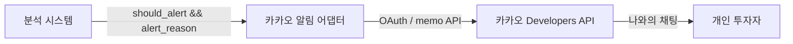
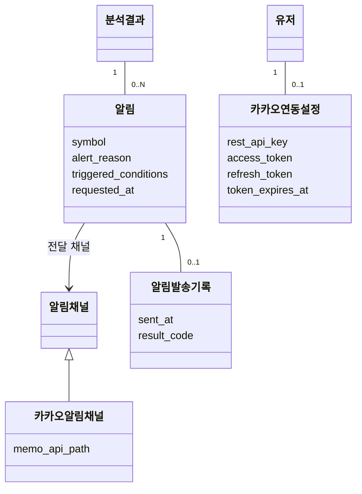
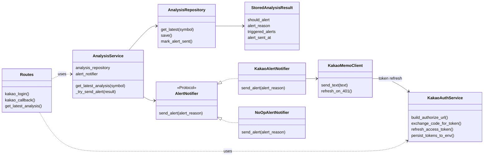
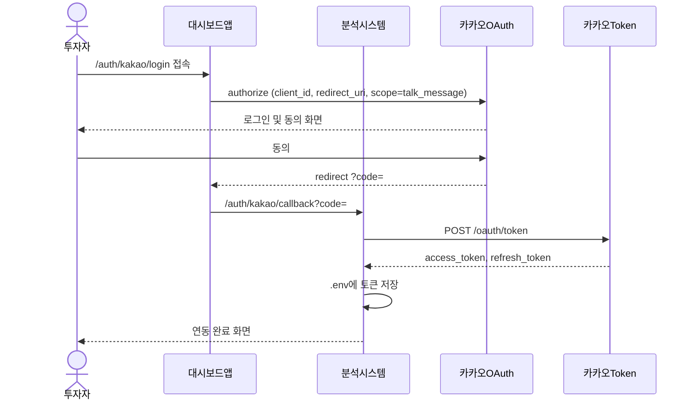
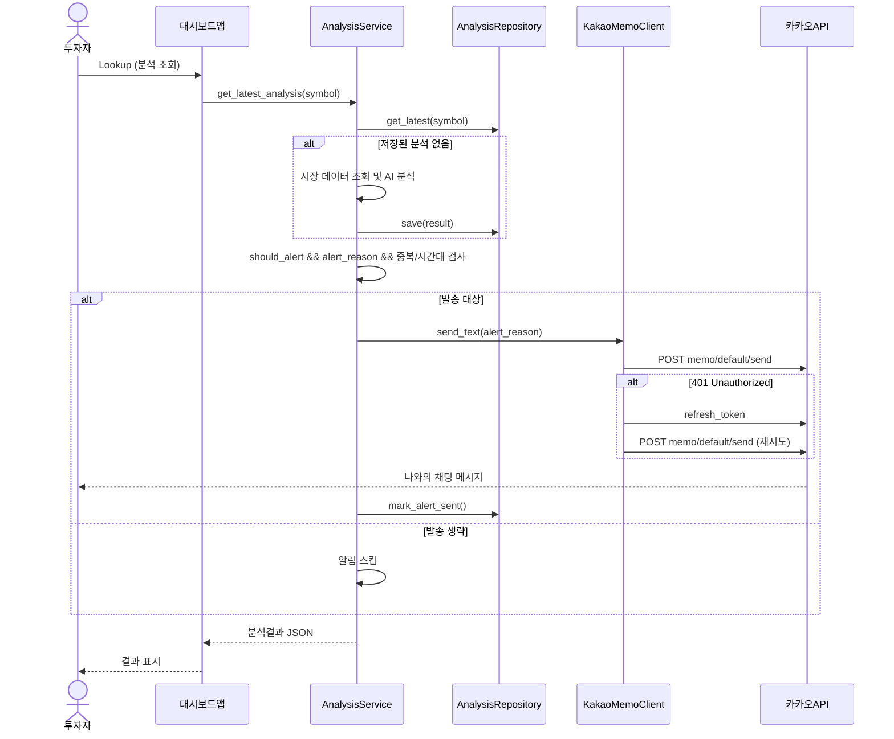
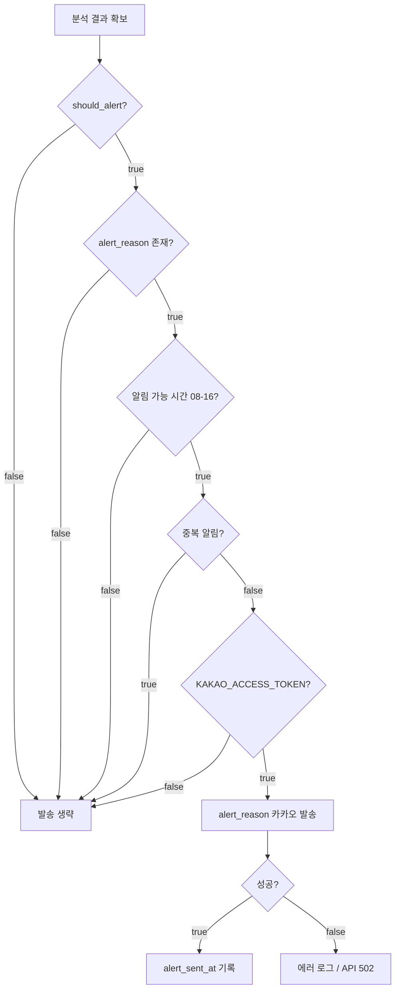

# 카카오톡 알림 설계

## 목적

[MVP 시스템 설계](mvp_system_design.md)에서 정의한 **알림 서비스**를 카카오톡 **나에게 보내기** API로 구현하기 위한 설계를 정의한다. 분석 시스템은 알림조건을 판단하고, 카카오 알림 어댑터는 판단 결과를 사용자 카카오톡으로 전달한다.

## 상위 설계와의 관계

| 상위 문서 | 본 문서에서 구체화하는 항목 |
| --------- | --------------------------- |
| [mvp_system_design.md](mvp_system_design.md) | 알림 서비스, 알림 발송 규칙, 알림 가능 시간대 |
| [domain_model.md](domain_model.md) | `알림` 도메인의 카카오 채널 구현 |
| [implementation_plan.md](implementation_plan.md) | v1에서 제외했던 알림 발송의 후속 구현 범위 |

MVP 전체 흐름에서 본 기능은 아래 **알림 서비스** 블록을 카카오톡으로 대체한다.



## 범위

### 포함 범위

- 카카오 Developers 앱 연동 (REST API 키, Redirect URI, `talk_message` 동의)
- 카카오 로그인 OAuth로 액세스·리프레시 토큰 발급
- 분석 결과 `should_alert == true`일 때 `alert_reason`만 카카오톡으로 발송
- 토큰 만료 시 리프레시 토큰으로 갱신
- 수동 Lookup 및 추후 스케줄 분석과 동일한 알림 진입점 제공

### 제외 범위

- 카카오 **친구에게 보내기** (추가 기능 신청·심사 필요)
- **알림톡** 비즈니스 메시지
- 이메일·텔레그램 등 다른 알림 채널
- 메시지 템플릿 피드·커머스 등 복잡한 카카오 메시지 UI
- 사용자별 다중 카카오 계정 (MVP는 단일 운영자 1인)

## 핵심 정책

[MVP 시스템 설계](mvp_system_design.md)의 알림 정책을 따른다.

| 정책 항목 | 결정 사항 |
| --------- | --------- |
| 발송 조건 | `should_alert == true` 이고 `alert_reason`이 비어 있지 않을 때 |
| 메시지 본문 | **`alert_reason`만** 전송 (종목·summary·지표 미포함) |
| 수신 대상 | 로그인한 본인 카카오톡 **나와의 채팅** |
| 중복 알림 | 같은 사용자·같은 종목·같은 조건에 대해 **한 번만** 발송 |
| 알림 가능 시간 | **08:00 ~ 16:00** (KST, [스케줄러 설계](scheduler_design.md)와 공통 적용) |
| 조건 판단 주체 | 분석 시스템 (Gemini agent + 시스템 알림조건). 카카오 API는 전달만 담당 |

유스케이스는 [kakao_use_case.drawio](kakao_use_case.drawio)를 참고한다.

## 도메인 모델

[domain_model.md](domain_model.md)의 `알림`을 카카오 채널로 구체화한다. OAuth 자격 증명은 MVP에서 별도 설정 값으로 다루며, 추후 `유저`와 연결할 수 있다.



### 도메인 모델 요소 (추가)

| 요소 | 설명 |
| ---- | ---- |
| 카카오알림채널 | `알림채널`의 카카오톡 구현. 나에게 보내기 API 사용 |
| 카카오연동설정 | REST API 키, OAuth 토큰, Redirect URI 등 연동에 필요한 설정 |
| 알림발송기록 | 중복 발송 방지 및 추적용. 종목·조건·발송 시각 저장 |

## 외부 API

| API | 메서드 | URL | 용도 |
| --- | ------ | --- | ---- |
| 인가 코드 요청 | GET | `https://kauth.kakao.com/oauth/authorize` | 카카오 로그인 시작 |
| 토큰 발급 | POST | `https://kauth.kakao.com/oauth/token` | code → access/refresh token |
| 토큰 갱신 | POST | `https://kauth.kakao.com/oauth/token` | `grant_type=refresh_token` |
| 나에게 메시지 | POST | `https://kapi.kakao.com/v2/api/talk/memo/default/send` | `alert_reason` 텍스트 발송 |

### 메시지 템플릿

기본 텍스트 템플릿만 사용한다.

```json
{
  "object_type": "text",
  "text": "{alert_reason}",
  "link": {}
}
```

## 애플리케이션 API

| 엔드포인트 | 설명 |
| ---------- | ---- |
| `GET /auth/kakao/login` | 카카오 OAuth 인가 URL로 리다이렉트 |
| `GET /auth/kakao/callback` | 인가 코드 수신, 토큰 교환, `.env` 저장 |
| `GET /stocks/{symbol}/analysis/latest` | 분석 조회 후 알림 조건 충족 시 발송 트리거 |

## 환경 변수

| 변수 | 필수 | 설명 |
| ---- | ---- | ---- |
| `KAKAO_REST_API_KEY` | O | 카카오 REST API 키 (`client_id`) |
| `KAKAO_REDIRECT_URI` | O | OAuth Redirect URI |
| `KAKAO_CLIENT_SECRET` | △ | 클라이언트 시크릿 사용 시 필수 |
| `KAKAO_ACCESS_TOKEN` | △ | 메시지 발송용. 로그인 후 자동 저장 |
| `KAKAO_REFRESH_TOKEN` | △ | 액세스 토큰 갱신용 |

## 구현 클래스 다이어그램

분석 서비스와 카카오 알림 모듈의 협력 관계를 표현한다. `AlertNotifier` 프로토콜로 채널을 교체 가능하게 유지한다.



## 시퀀스 다이어그램

### 카카오 연동 (최초 1회)



### 분석 알림 발송



## 발송 판단 흐름



## 카카오 Developers 사전 설정

| 설정 위치 | 항목 |
| --------- | ---- |
| 플랫폼 키 → REST API 키 | Redirect URI: `{origin}/auth/kakao/callback` |
| 카카오 로그인 → 일반 | 사용 설정 ON |
| 카카오 로그인 → 동의항목 | 카카오톡 메시지 전송 (`talk_message`) |
| 플랫폼 → Web | 사이트 도메인 등록 |

## 오류 대응

| 코드/상황 | 원인 | 대응 |
| --------- | ---- | ---- |
| KOE101 | 잘못된 `client_id` | REST API 키 확인 |
| KOE004 | 카카오 로그인 OFF | 사용 설정 ON |
| KOE205 | `talk_message` 미설정 | 동의항목 추가 |
| KOE006 | Redirect URI 불일치 | REST API 키 Redirect URI 등록 |
| KOE010 | 클라이언트 시크릿 불일치 | `.env`에 `KAKAO_CLIENT_SECRET` |
| 401 on memo API | 토큰 만료 | refresh 후 재시도, 실패 시 재로그인 안내 |

## 테스트 관점

- `AlertNotifier`를 mock으로 주입해 분석 API가 `alert_reason`만 전달하는지 검증
- `should_alert == false`이면 notifier 미호출
- 중복·시간대 정책 단위 테스트 (추후)
- 카카오 HTTP 호출은 테스트에서 mock 처리

## 후속 작업

- [x] [스케줄러 설계](scheduler_design.md)와 연동: 장중 1시간 주기 자동 분석·발송
- [x] 알림 가능 시간대(08~16 KST) 필터 구현
- [x] 중복 알림 방지 (`alert_sent_at` + `triggered_alerts` 기준) 정책 정합
- [x] 운영 가이드 문서 ([kakao_setup_guide.md](../docs/kakao_setup_guide.md)) 작성

## Assumptions

- MVP는 **단일 사용자·단일 카카오 계정**을 가정한다.
- 메시지는 투자 조언이 아닌 **정보 제공용 `alert_reason`**만 포함한다.
- 토큰 저장소는 MVP에서 `.env` 파일이며, 추후 DB 또는 시크릿 관리로 이전할 수 있다.
- 친구 메시지·알림톡은 사업자 심사가 필요하므로 범위에서 제외한다.
