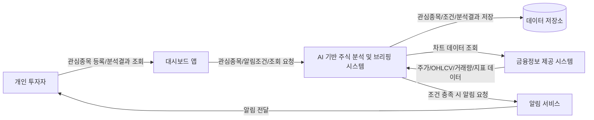
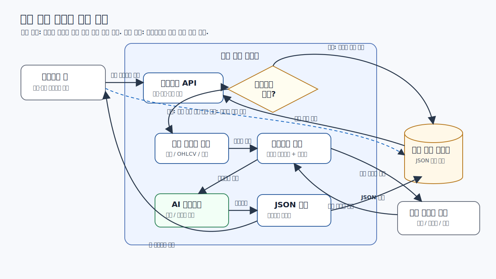
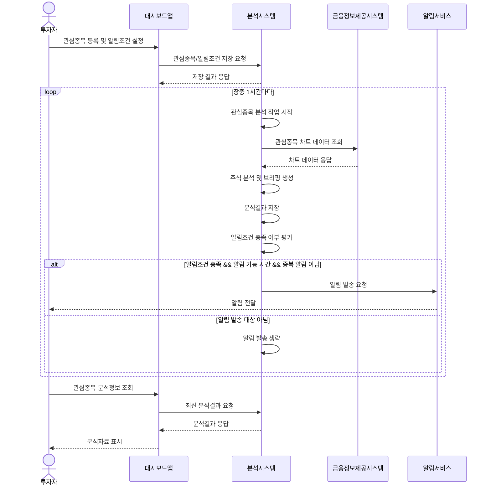

# MVP 시스템 설계

## 목적

AI 기반 주식 분석 및 브리핑 시스템의 초기 구현 범위를 정의한다. MVP는 관심종목 등록, 장중 주기 분석, 분석 결과 조회, 조건부 알림 발송에 집중한다.

## MVP 범위

### 포함 범위

- 관심종목 등록 및 삭제
- 장중 1시간 단위 관심종목 분석
- 등록된 관심종목 전체 분석
- 금융 데이터 조회 및 AI 분석 결과 생성
- 대시보드에서 최신 분석 결과 조회
- 시스템 기본 알림조건 및 사용자 알림조건 평가
- 조건 충족 시 외부 알림 서비스로 알림 발송

### 제외 범위

- 실시간 틱 데이터 기반 분석
- 사용자별 복잡한 조건 빌더
- 여러 알림 채널 동시 라우팅
- 포트폴리오 최적화 또는 자동매매
- 과거 분석 결과를 활용한 고도화된 백테스팅

## 핵심 정책

| 정책 항목        | 결정 사항                                                   |
| ---------------- | ----------------------------------------------------------- |
| 분석 주기        | 1시간마다 실행                                              |
| 분석 시간        | 장중에만 실행                                               |
| 분석 대상        | 등록된 관심종목 전체                                        |
| 알림 발송 조건   | 분석 결과가 시스템 또는 사용자 알림조건을 충족할 때          |
| 중복 알림 정책   | 같은 사용자, 같은 종목, 같은 조건에 대해서는 반복 발송하지 않음 |
| 알림 가능 시간대 | 오전 8시부터 오후 4시까지                                  |

## 분석 결과 구조

AI agent의 분석 결과는 대시보드 조회와 알림조건 평가에 함께 사용할 수 있는 구조를 가진다.

| 항목           | 설명                                                         |
| -------------- | ------------------------------------------------------------ |
| 종목           | 분석 대상 종목                                               |
| 분석시점       | 분석이 수행된 시각                                           |
| 데이터기준시점 | 분석에 사용된 금융 데이터의 기준 시각                        |
| 종합판단       | 상승, 하락, 중립, 관망 등 분석 시스템의 요약 판단            |
| 요약           | 투자자가 빠르게 읽을 수 있는 핵심 브리핑                     |
| 핵심근거       | 가격 흐름, 거래량, 변동성, 기술지표 등 판단에 사용된 주요 근거 |
| 리스크요인     | 판단과 반대로 움직일 수 있는 위험 요소                       |
| 주요지표       | 분석에 사용된 주요 수치 또는 지표                            |
| 알림판정       | 알림조건 충족 여부                                           |
| 충족한알림조건 | 충족된 시스템알림조건 또는 유저알림조건 목록                 |
| 알림사유       | 알림을 보내야 하는 이유를 사용자에게 설명할 수 있는 문장      |

## 알림조건

알림조건은 시스템이 기본 제공하는 조건과 사용자가 직접 설정하는 조건으로 나눈다. 알림 서비스는 조건을 판단하지 않고, 분석 시스템이 판단한 알림 요청을 전달한다.

### 시스템알림조건

- 급등락: 일정 수준 이상의 가격 변동이 발생한 경우
- 거래량 급증: 평소 대비 거래량이 유의미하게 증가한 경우
- 변동성 확대: 단기 변동성이 커져 주의가 필요한 경우
- 기술적 이상 징후: 주요 기술지표에서 의미 있는 변화가 감지된 경우

### 유저알림조건

- 특정 가격 도달
- 특정 등락률 도달
- 특정 거래량 기준 충족
- 이동평균선 골든크로스 또는 데드크로스
- 사용자가 관심 있게 보는 특정 지표 조건 충족

### 알림 발송 규칙

- 알림은 분석 결과가 하나 이상의 알림조건을 충족한 경우에만 발송한다.
- 같은 사용자, 같은 종목, 같은 조건에 대한 알림은 한 번만 발송한다.
- 알림은 오전 8시부터 오후 4시까지만 발송한다.
- 알림 가능 시간 밖에 조건이 충족된 경우에는 즉시 발송하지 않고, 해당 조건의 처리 방식을 별도 정책으로 정한다.

## 시스템 구성도

## 분석 시스템 내부 구조

대시보드 앱은 분석 시스템의 API를 통해 관심종목의 최신 분석결과를 조회한다. 이 API는 기본적으로 저장된 최신 분석결과를 반환하며, 분석결과가 없는 경우에만 분석 시스템 내부에서 금융 데이터 조회, 프롬프트 구성, AI 에이전트 분석, JSON 저장을 수행한 뒤 새 분석결과를 반환한다.

## 시스템 시퀀스

