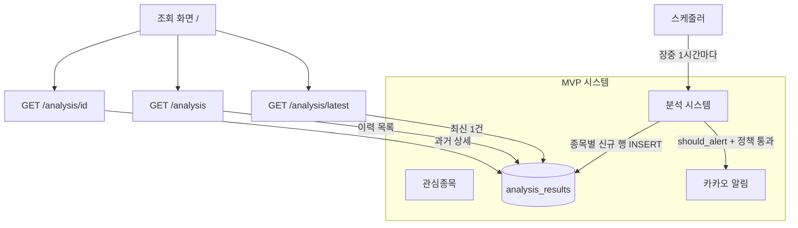
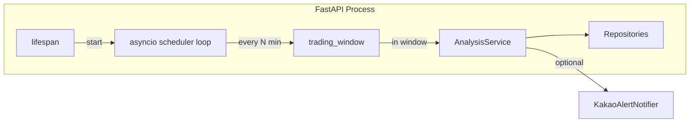
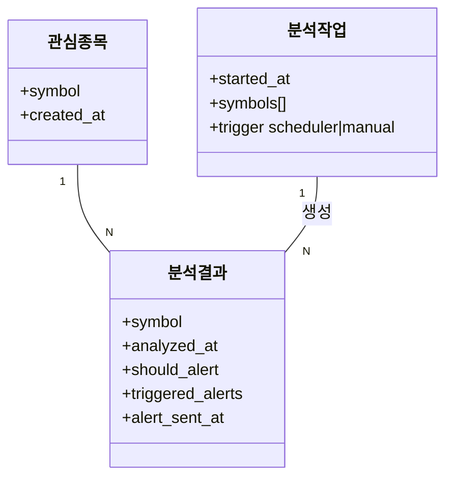
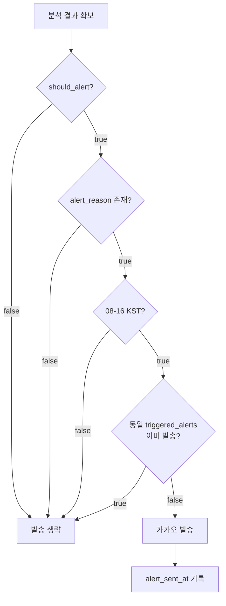
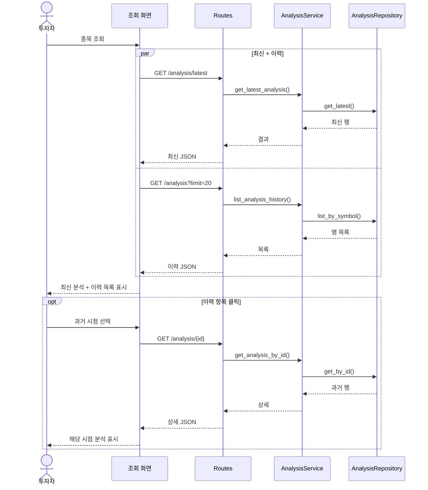

# 장중 1시간 스케줄러 설계

## 목적

[MVP 시스템 설계](mvp_system_design.md)에서 정의한 **장중 1시간 단위 관심종목 분석**을 구현한다. 스케줄러는 등록된 관심종목 전체에 대해 주기적으로 AI 분석을 수행하고, **분석결과를 시계열로 축적**한다. 조건 충족 시 [카카오 알림 설계](kakao_notification_design.md)와 동일한 정책으로 알림을 발송한다.

## 상위 설계와의 관계

| 상위 문서 | 본 문서에서 구체화하는 항목 |
| --------- | --------------------------- |
| [mvp_system_design.md](mvp_system_design.md) | 분석 주기(1시간), 장중 실행, 관심종목 전체 분석, 알림 시간대·중복 정책 |
| [domain_model.md](domain_model.md) | `분석작업` → 스케줄 실행 단위로 매핑 |
| [kakao_notification_design.md](kakao_notification_design.md) | 스케줄 분석 후 알림 발송 진입점 |
| [implementation_plan.md](implementation_plan.md) | v1에서 제외했던 주기 스케줄러의 후속 구현 |



## 범위

### 포함 범위

- FastAPI 프로세스 내 **백그라운드 스케줄러** (별도 워커 프로세스 없음)
- 관심종목(`watchlist_items`) 전체 순회 분석
- 실행 주기: **60분 간격** (환경변수로 조정 가능)
- 실행 시간대: **장중 KST** (기본 08:00 ~ 16:00, 미포함 16:00)
- 매 실행마다 종목별 **새 `analysis_results` 행 생성** (데이터 축적)
- 알림 가능 시간(08~16 KST) 및 중복 알림 방지 (`triggered_alerts` 기준)
- 수동 실행 API (`POST /scheduler/run`) — 개발·운영 점검용
- 스케줄러 ON/OFF 환경변수
- **분석 이력 조회 API** (`GET /stocks/{symbol}/analysis`, `GET /stocks/{symbol}/analysis/{id}`)
- **조회 화면** (`GET /`)에서 최신 분석·이전 이력 목록·과거 상세 표시

### 제외 범위

- 분 단위·틱 단위 실시간 스케줄
- Celery / Redis / 별도 cron 서버
- 장 마감 후 미발송 알림 큐잉·익일 재발송
- 다중 인스턴스 간 분산 락 (MVP는 단일 서버 가정)
- 스케줄 실행 이력 전용 테이블 (로그로 대체)

## 핵심 정책

| 정책 항목 | 결정 사항 |
| --------- | --------- |
| 실행 주기 | **60분** (`SCHEDULER_INTERVAL_MINUTES`, 기본값 60) |
| 실행 시간대 | **08:00 ≤ 시각 < 16:00 KST** (`SCHEDULER_MARKET_*`) |
| 분석 대상 | `watchlist_items`에 등록된 **전체 종목** |
| 데이터 축적 | 매 실행마다 종목별 **INSERT** (기존 행 덮어쓰기 없음) |
| 조회 API 동작 | `GET .../analysis/latest`는 **최신 1건** 반환; 캐시 없을 때만 즉시 분석 |
| 이력 조회 | `GET .../analysis`는 **저장된 행 목록**(최신순); 재분석·알림 없음 |
| 과거 상세 | `GET .../analysis/{id}`는 **특정 시점** 분석 전체 필드 반환; 재분석·알림 없음 |
| 알림 발송 | `should_alert && alert_reason` + **08~16 KST** + **중복 아님** |
| 중복 알림 | 동일 종목·동일 `triggered_alerts` 조합으로 **이미 발송한 적 있으면** 생략 |
| 실패 처리 | 종목 단위 실패는 로그 후 **다음 종목 계속**; 스케줄 루프는 유지 |
| 빈 관심종목 | 실행 스킵 (로그만 남김) |

### 조회 API vs 스케줄러

| 경로 | 분석 트리거 | DB 쓰기 | 알림 |
| ---- | ----------- | ------- | ---- |
| `GET .../analysis/latest` | 저장된 결과 **없을 때만** | 최초 1건 | 정책 통과 시 발송 |
| `GET .../analysis` | **없음** (읽기 전용) | 없음 | 없음 |
| `GET .../analysis/{id}` | **없음** (읽기 전용) | 없음 | 없음 |
| 스케줄러 (1시간) | **매번** | **매번 신규 행** | 정책 통과 시 발송 |

이 구분으로 대시보드 조회는 빠르게 유지하고, 스케줄러는 **시계열 데이터 축적**을 담당한다. 사용자는 스케줄러가 쌓아 둔 **이전 분석**을 이력 API·화면으로 확인한다.

유스케이스는 [scheduler_use_case.drawio](scheduler_use_case.drawio)를 참고한다.

## 아키텍처



### 모듈 책임

| 모듈 | 책임 |
| ---- | ---- |
| `app/scheduler.py` | asyncio 주기 루프, lifespan 연동, 배치 실행 오케스트레이션 |
| `app/trading_window.py` | KST 장중·알림 가능 시간 판정 (순수 함수, 테스트 용이) |
| `app/services.py` | `analyze_and_store`, `run_scheduled_batch`, 알림 정책 |
| `app/repositories.py` | 관심종목 목록, 분석결과 INSERT·목록·단건 조회, 중복 알림 조회 |
| `app/routes.py` | `POST /scheduler/run`, 분석 이력·상세·최신 조회 API, 조회 화면 |

## 도메인 모델 매핑

[domain_model.md](domain_model.md)의 `분석작업`을 런타임 개념으로 매핑한다. MVP에서는 별도 `analysis_jobs` 테이블 없이 **스케줄 1회 = 배치 분석작업**으로 취급한다.



추후 `analysis_jobs` 테이블을 도입하면 `분석작업`을 영속화할 수 있다.

## 시퀀스: 장중 1시간 배치

```mermaid
sequenceDiagram
    participant Loop as SchedulerLoop
    participant TW as trading_window
    participant Svc as AnalysisService
    participant WL as WatchlistRepository
    participant AR as AnalysisRepository
    participant MD as MarketDataProvider
    participant Agent as AnalysisAgent
    participant Kakao as AlertNotifier

    Loop->>Loop: sleep(interval)
    Loop->>TW: is_market_hours(now)?
    alt 장외
        Loop->>Loop: skip (log)
    else 장중
        Loop->>Svc: run_scheduled_batch()
        Svc->>WL: list()
        loop 각 symbol
            Svc->>MD: fetch(symbol)
            Svc->>Agent: analyze(snapshot)
            Svc->>AR: save() — 신규 행
            Svc->>Svc: should_send_alert?
            alt 발송 대상
                Svc->>Kakao: send_alert(alert_reason)
                Svc->>AR: mark_alert_sent()
            end
        end
    end
```

## 데이터 축적 모델

`analysis_results`는 **append-only 시계열**로 다룬다.

```
symbol=005930.KS
├── id=1  analyzed_at=09:00  summary=...
├── id=2  analyzed_at=10:00  summary=...
└── id=3  analyzed_at=11:00  summary=...
```

- `get_latest(symbol)`: `ORDER BY analyzed_at DESC LIMIT 1`
- `list_by_symbol(symbol, limit, offset)`: 최신순 목록 (이력 API)
- `get_by_id(symbol, id)`: 특정 시점 상세 (상세 API)
- 조회 화면은 최신 1건을 기본 표시하고, 이력 목록에서 과거 행을 선택해 상세 확인

## 설정

`.env` / `.env.example`:

| 변수 | 기본값 | 설명 |
| ---- | ------ | ---- |
| `SCHEDULER_ENABLED` | `true` | `false`면 루프 미기동 |
| `SCHEDULER_INTERVAL_MINUTES` | `60` | 실행 간격(분) |
| `SCHEDULER_TIMEZONE` | `Asia/Seoul` | 장중 판정 타임존 |
| `SCHEDULER_MARKET_START_HOUR` | `8` | 장중 시작 시 (포함) |
| `SCHEDULER_MARKET_END_HOUR` | `16` | 장중 종료 시 (**미포함**) |

알림 가능 시간은 장중 설정과 **동일한 08~16 KST**를 사용한다 ([kakao_notification_design.md](kakao_notification_design.md) 정합).

## 알림 연동

발송 판단은 Lookup·스케줄러·수동 실행 **공통** `AnalysisService._try_send_alert` 경로를 탄다.



## API

| 메서드 | 경로 | 설명 |
| ------ | ---- | ---- |
| GET | `/stocks/{symbol}/analysis/latest` | 최신 1건 (없으면 즉시 분석) |
| GET | `/stocks/{symbol}/analysis` | 이력 목록 (`limit`, `offset`; 경량 필드) |
| GET | `/stocks/{symbol}/analysis/{id}` | 특정 시점 분석 상세 |
| GET | `/` | 조회 화면 (최신 + 이력 목록) |
| POST | `/scheduler/run` | 즉시 배치 1회 실행 (장중 검사 **우회** 가능 쿼리 `force=true`) |

응답 예:

```json
{
  "ran": true,
  "symbols_analyzed": ["005930.KS", "AAPL"],
  "symbols_failed": [],
  "skipped_reason": null
}
```

## 시퀀스: 이전 분석 이력 조회



## 오류 대응

| 상황 | 동작 |
| ---- | ---- |
| 관심종목 0개 | 배치 스킵, `symbols_analyzed: []` |
| 특정 종목 market data 실패 | 해당 종목만 `symbols_failed`, 나머지 계속 |
| Gemini 실패 | 동일 |
| 카카오 발송 실패 | 분석 행은 저장됨, `alert_sent_at` 미기록, 로그 |
| 스케줄러 비활성 | lifespan에서 루프 미시작 |

## 테스트 관점

- `trading_window`: 경계 시각(07:59, 08:00, 15:59, 16:00) 단위 테스트
- `run_scheduled_batch`: 관심종목 N개 → N번 agent 호출, N개 행 INSERT
- 장외 시 루프 스킵 (mock clock)
- 중복 `triggered_alerts` 시 알림 1회만
- 장외 시각 분석 결과는 알림 미발송
- `POST /scheduler/run` 수동 실행
- 이력 API: 스케줄러 저장분만 반환, agent·market data 미호출
- 이력 상세: 존재하지 않는 `id` → 404

## 후속 작업

- [ ] `analysis_jobs` 테이블로 배치 실행 이력 영속화
- [ ] 다중 인스턴스 환경 분산 락 (Redis advisory lock 등)
- [ ] 장 마감 후 조건 충족 알림 익일 정책
- [x] 분석 이력 조회 API (`GET /stocks/{symbol}/analysis`, `GET /stocks/{symbol}/analysis/{id}`) 및 조회 화면
- [ ] 기간·판단 필터가 있는 이력 검색 API
- [ ] Prometheus 메트릭 (실행 횟수, 실패율, 소요 시간)

## Assumptions

- MVP는 **단일 uvicorn 프로세스** 1개만 실행한다 (`scripts/dev.ps1` 권장).
- KRX 정규장(09:00~15:30)과 알림 정책(08~16) 차이는 MVP에서 **동일 윈도우(08~16)** 로 단순화한다.
- 스케줄러 첫 실행은 서버 기동 후 **interval 경과 후**이다 (기동 즉시 1회는 수동 `/scheduler/run` 사용).
- Gemini API 호출 비용은 관심종목 수 × 시간당 1회를 감수한다.
