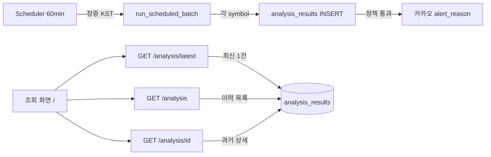

# PR: 장중 1시간 스케줄러 및 분석결과 시계열 축적

## Summary

- 관심종목 전체를 **60분마다** 자동 분석하는 백그라운드 스케줄러를 FastAPI lifespan에 통합했습니다.
- 매 실행마다 종목별 **`analysis_results` 신규 행을 INSERT**하여 시계열 데이터가 쌓이도록 했습니다.
- 스케줄러가 저장한 **이전 분석 이력**을 `GET /stocks/{symbol}/analysis`·`GET /stocks/{symbol}/analysis/{id}` 및 조회 화면(`/`)에서 확인할 수 있습니다.
- [MVP](mvp_system_design.md) 및 [카카오 알림 설계](kakao_notification_design.md)와 정합되게 **08~16 KST 알림 시간대**와 **`triggered_alerts` 기준 중복 발송 방지**를 `AnalysisService`에 반영했습니다.
- 운영·개발 점검용 **`POST /scheduler/run`** (옵션 `force=true`) 엔드포인트를 추가했습니다.
- 상세 설계는 [`design/scheduler_design.md`](scheduler_design.md)를 참고하세요.

## 변경 파일

| 영역 | 파일 |
| ---- | ---- |
| 설계 | `design/scheduler_design.md`, `design/scheduler_pr_description.md` |
| 스케줄러 | `app/scheduler.py`, `app/scheduler_config.py`, `app/trading_window.py` |
| 도메인 | `app/services.py`, `app/repositories.py` |
| API / 기동 | `app/main.py`, `app/routes.py` |
| 설정 | `.env.example` |
| 테스트 | `tests/test_scheduler.py`, `tests/conftest.py`, `tests/test_api.py` |

## 동작 요약



| 경로 | 분석 | DB | 알림 |
| ---- | ---- | -- | ---- |
| 스케줄러 | 매번 전 종목 | 매번 INSERT | 08~16 KST + 중복 방지 |
| `GET .../latest` | 캐시 없을 때만 | 최초 1건 | 동일 정책 |
| `GET .../analysis` | 없음 | 읽기 전용 | 없음 |
| `GET .../analysis/{id}` | 없음 | 읽기 전용 | 없음 |

## 환경변수

```env
SCHEDULER_ENABLED=true
SCHEDULER_INTERVAL_MINUTES=60
SCHEDULER_TIMEZONE=Asia/Seoul
SCHEDULER_MARKET_START_HOUR=8
SCHEDULER_MARKET_END_HOUR=16
```

## Test plan

- [x] `pytest` 전체 통과
- [ ] `SCHEDULER_ENABLED=true`로 서버 기동 후 로그에 `Scheduler started` 확인
- [ ] 관심종목 등록 후 `POST /scheduler/run?force=true` → `symbols_analyzed` 응답 확인
- [ ] 동일 종목 2회 실행 후 DB에 `analysis_results` 2행 축적 확인
- [ ] `GET /stocks/{symbol}/analysis` 이력 목록 및 `/analysis/{id}` 과거 상세 조회 확인
- [ ] `should_alert=true` 종목: 첫 배치만 카카오 발송, 두 번째 배치는 중복 스킵 확인
- [ ] 장외 시각(또는 `force=false` + 장외) 스케줄 스킵 확인

## Breaking changes

- 알림: 동일 종목·동일 `triggered_alerts` 조합은 **1회만** 발송 (기존 Lookup마다 매번 발송하던 동작에서 변경)
- 알림: **08~16 KST** 외 시각에는 발송하지 않음

## Assumptions

- 단일 uvicorn 프로세스 (`scripts/dev.ps1` 권장)
- 스케줄러 첫 자동 실행은 기동 후 60분 경과 시 (즉시 1회는 `/scheduler/run` 사용)
