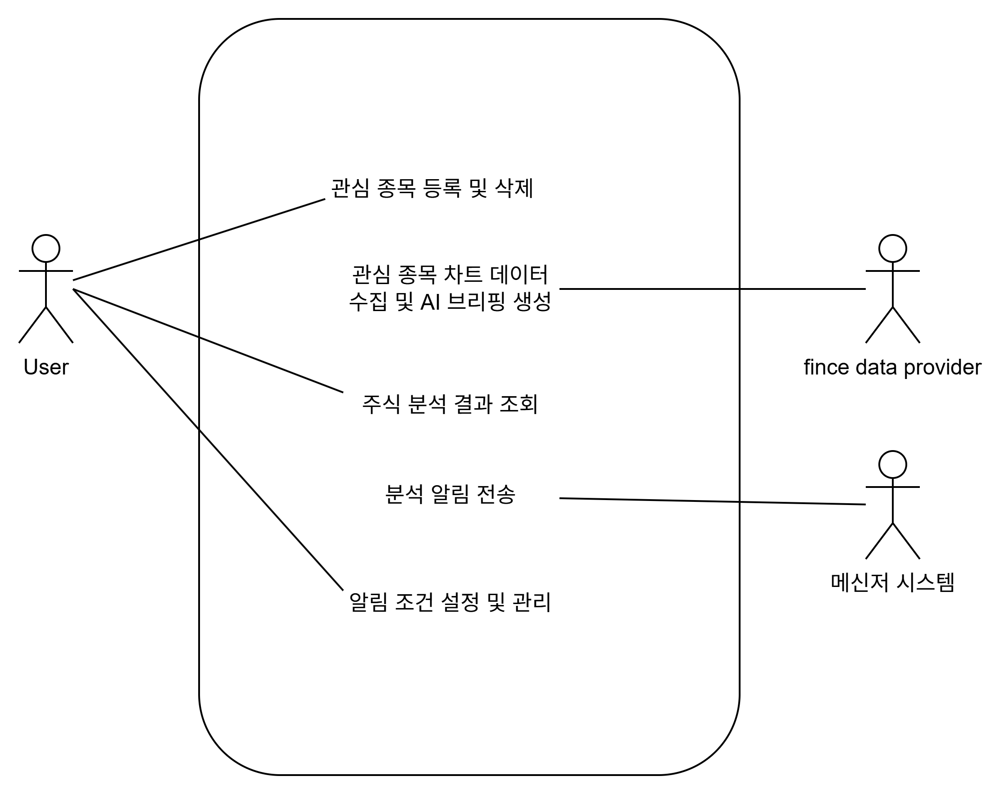
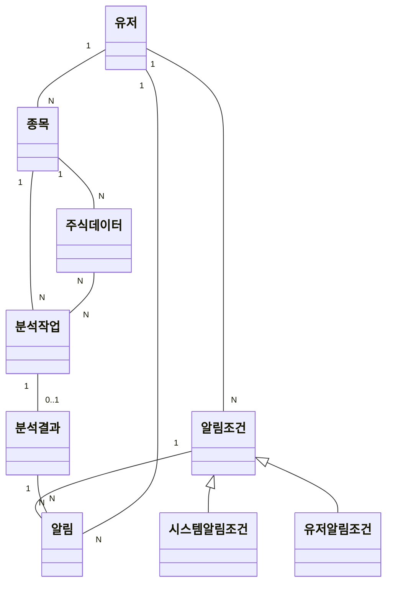
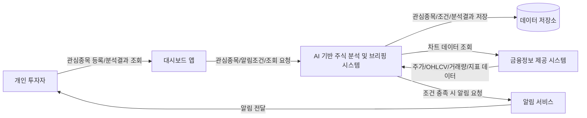
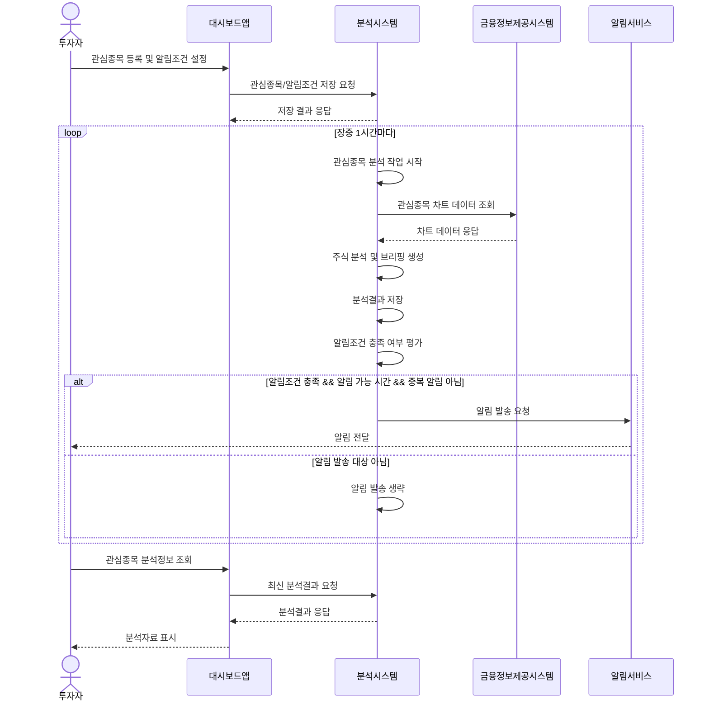
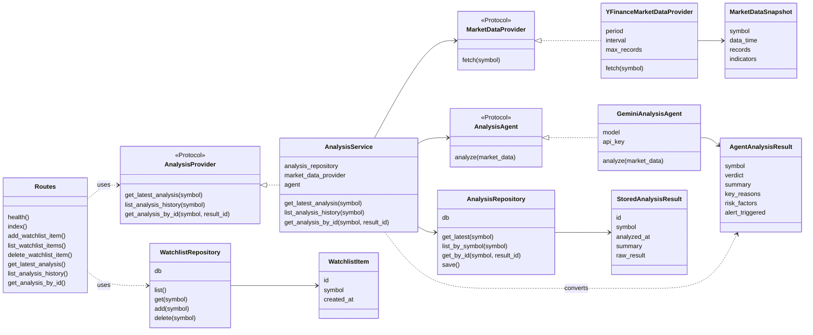

## 액터

| 구분            | 라벨                               | 비고                                                            |
| --------------- | ---------------------------------- | --------------------------------------------------------------- |
| 시스템(Subject) | AI 기반 주식 분석 및 브리핑 시스템 | 대시보드, 백엔드/API, 분석 시스템 포함                          |
| 주 액터         | 개인 투자자                        | 관심 종목을 등록하고 분석 결과 및 알림을 확인하는 사용자        |
| 보조 액터       | 금융 데이터 제공 시스템            | 주가, OHLCV, 거래량, 기술지표 계산에 필요한 원천 데이터 제공    |
| 보조 액터       | 알림 서비스                        | 분석 결과 또는 조건 충족 알림을 사용자에게 전달하는 외부 서비스 |

## 유스케이스

### 유스케이스 목록

**1. 관심 종목 등록 및 관리**

- 주 액터 : 개인투자자
- 부 액터 : x
- 내용 : 유저가 대시보드에서 원하는 종목을 선택하여 자기의 관심종목으로 추가하거나 삭제한다

**2. 주기적 차트 데이터 수집 및 AI 브리핑 생성**

- 백그라운드에서 장중 1시간마다 모든 관심종목에 대한 데이터를 금융데이터 제공 시스템에서 조회하고, 분석한다

**3. 주식 분석 결과 확인**

- 백그라운드에서 AI가 관심종목에 대한 데이터를 분석한 내용을 대시보드에서 조회 및 확인한다
- 최신 분석 1건과 스케줄러가 저장한 **이전 분석 이력**을 목록·상세로 확인할 수 있다

**4. 조건부 분석 알림 발송 (Refined Version)**

- 액터(주체): 시스템(백그라운드 워커), 외부 알림 서비스(텔레그램/이메일 등), 유저(수신)
- 발생 조건 (Trigger):

- A (사용자 맞춤형): 유저가 사전에 설정한 조건(예: 특정 가격 도달, 특정 지표 골든크로스)이 감지되었을 때.
- B (시스템 기본형): 종목의 급등락(예: 하루 변동폭 5% 이상) 등 시장 이상 징후가 발생했을 때.

- AI 가 분석한 내용이 특정 알림조건에 해당하면, 시스템이 유저에게 알림을 보낸다

## MVP 범위

초기 구현 범위는 사용자가 관심종목을 등록하고, 시스템이 장중에 주기적으로 전체 관심종목을 분석한 뒤, 조건을 만족한 경우에만 알림을 보내는 흐름으로 한정한다.

### 포함 범위

- 관심종목 등록 및 삭제
- 장중 1시간 단위 관심종목 분석
- 금융 데이터 조회 및 분석 결과 생성
- 대시보드에서 최신·이전 분석 결과 조회
- 시스템 기본 알림조건 및 사용자 알림조건 평가
- 조건 충족 시 외부 알림 서비스로 알림 발송

### 제외 범위

- 실시간 틱 데이터 기반 분석
- 사용자별 복잡한 조건 빌더
- 여러 알림 채널 동시 라우팅
- 포트폴리오 최적화 또는 자동매매
- 과거 분석 결과를 활용한 고도화된 백테스팅

## 핵심 정책

| 정책 항목        | 결정 사항                                                              |
| ---------------- | ---------------------------------------------------------------------- |
| 분석 주기        | 1시간마다 실행                                                         |
| 분석 시간        | 장중에만 실행                                                          |
| 분석 대상        | 등록된 관심종목 전체                                                   |
| 알림 발송 조건   | 분석 결과가 시스템 또는 사용자 알림조건을 충족할 때                    |
| 중복 알림 정책   | 같은 사용자, 같은 종목, 같은 조건에 대해서는 반복 알림을 보내지 않는다 |
| 알림 가능 시간대 | 오전 8시부터 오후 4시까지로 제한한다                                   |

## 분석 결과 구조

AI agent의 분석 결과는 단순한 자연어 요약만이 아니라, 대시보드 표시와 알림조건 평가에 함께 사용할 수 있는 구조를 가져야 한다.

| 항목           | 설명                                                           |
| -------------- | -------------------------------------------------------------- |
| 종목           | 분석 대상 종목                                                 |
| 분석시점       | 분석이 수행된 시각                                             |
| 데이터기준시점 | 분석에 사용된 금융 데이터의 기준 시각                          |
| 종합판단       | 상승, 하락, 중립, 관망 등 분석 시스템의 요약 판단              |
| 요약           | 투자자가 빠르게 읽을 수 있는 핵심 브리핑                       |
| 핵심근거       | 가격 흐름, 거래량, 변동성, 기술지표 등 판단에 사용된 주요 근거 |
| 리스크요인     | 판단과 반대로 움직일 수 있는 위험 요소                         |
| 주요지표       | 분석에 사용된 주요 수치 또는 지표                              |
| 알림판정       | 알림조건 충족 여부                                             |
| 충족한알림조건 | 충족된 시스템알림조건 또는 유저알림조건 목록                   |
| 알림사유       | 알림을 보내야 하는 이유를 사용자에게 설명할 수 있는 문장       |

## 알림조건

알림조건은 시스템이 기본으로 제공하는 조건과 사용자가 직접 설정하는 조건으로 나눈다. 알림 서비스는 조건을 판단하지 않고, 분석 시스템이 판단한 알림 요청을 전달하는 역할만 가진다.

### 시스템알림조건

- 급등락: 일정 수준 이상의 가격 변동이 발생한 경우
- 거래량 급증: 평소 대비 거래량이 유의미하게 증가한 경우
- 변동성 확대: 단기 변동성이 커져 주의가 필요한 경우
- 기술적 이상 징후: 주요 기술지표에서 의미 있는 변화가 감지된 경우

### 유저알림조건

- 특정 가격 도달
- 특정 등락률 도달
- 특정 거래량 기준 충족
- 이동평균선 골든크로스 또는 데드크로스
- 사용자가 관심 있게 보는 특정 지표 조건 충족

### 알림 발송 규칙

- 알림은 분석 결과가 하나 이상의 알림조건을 충족한 경우에만 발송한다.
- 같은 사용자, 같은 종목, 같은 조건에 대한 알림은 한 번만 발송한다.
- 알림은 오전 8시부터 오후 4시까지만 발송한다.
- 알림 가능 시간 밖에 조건이 충족된 경우에는 즉시 발송하지 않고, 해당 조건의 처리 방식을 별도 정책으로 정해야 한다.

## 유스케이스 다이어그램

## 도메인 모델링

도메인이란?

- 문제를 해결하기 위해 사용자가 **이** 프로그램을 사용하는 분야
- 외부 시스템이나 **UI/플랫폼관심사**는 포함시키지 않는다

### 도메인 모델

- 유저
- 종목
- 주식데이터
- 분석작업
- 분석결과
- 알림조건
- 시스템알림조건
- 유저알림조건
- 알림

## 시스템 구성도

아래 구성도는 구현 세부 기술을 제외하고, 시스템 경계와 외부 의존성을 중심으로 표현한다.

## 시스템 시퀀스 다이어그램

아래 시퀀스는 시스템 레벨의 흐름만 표현한다. 분석은 사용자의 직접 요청이 아니라 백그라운드에서 주기적으로 실행되며, 알림은 분석 결과가 사전에 정의된 조건을 충족한 경우에만 발송된다.

### 시퀀스 관점 보완 메모

- 현재 초안에서 분석 시스템이 사용자 요청을 기다리는 것처럼 보일 수 있으므로, 실제 핵심 흐름은 분석시스템이 내부적으로 주기적 분석을 수행하는 구조로 보는 것이 자연스럽다.
- 알림은 분석 결과 생성과 분리해서 생각해야 한다. 분석 결과는 항상 저장될 수 있지만, 알림 발송은 사용자 조건 또는 시스템 기본 조건을 만족할 때만 발생한다.
- 대시보드앱은 분석을 직접 수행하기보다 관심종목/조건 설정과 분석결과 조회의 진입점으로 제한하는 편이 시스템 경계를 더 명확하게 만든다.

## 구현 클래스 다이어그램

아래 다이어그램은 현재 구현에서 중요한 협력 관계만 표현한다. 핵심은 `AnalysisService`가 최신 분석결과 조회를 담당하고, 저장된 결과가 없을 때만 금융 데이터 조회와 Gemini 분석을 수행한 뒤 저장소에 결과를 남긴다는 점이다. 이력 조회는 `list_analysis_history`·`get_analysis_by_id`로 DB만 읽는다.

