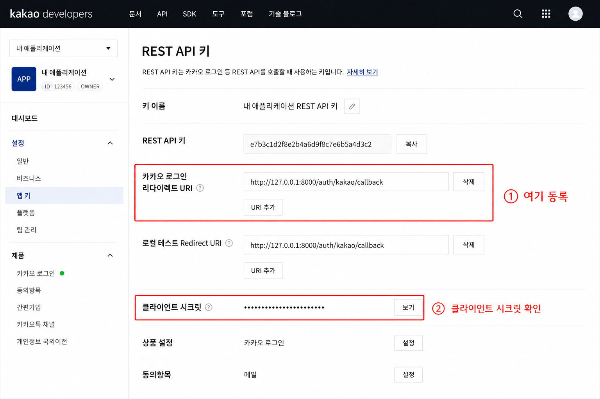
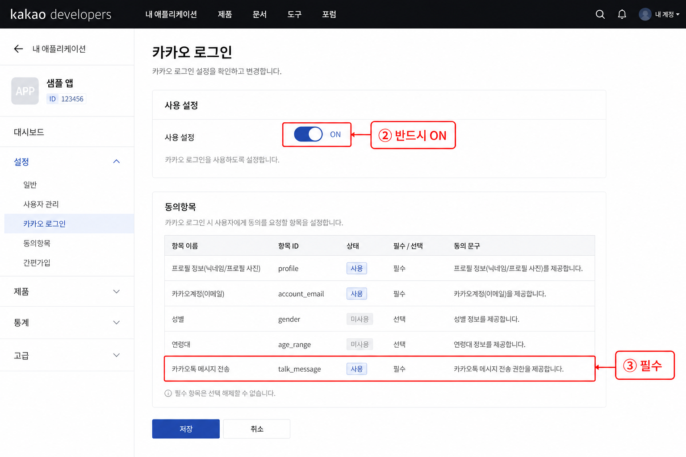
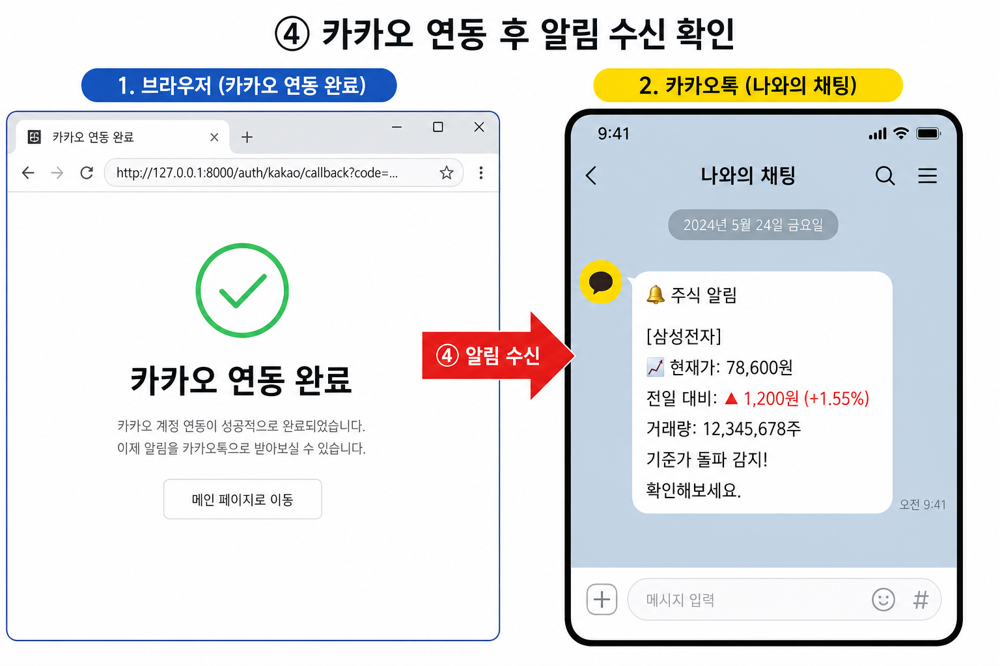

# 카카오톡 알림 연동 가이드

Stock Agent에서 분석 알림을 **카카오톡 나에게 보내기**로 받기 위한 설정·연동·테스트 절차입니다.

> **관련 문서**
> - 설계: [kakao_notification_design.md](../design/kakao_notification_design.md)
> - 유스케이스: [kakao_use_case.drawio](../design/kakao_use_case.drawio)

---

## 전체 흐름 한눈에 보기

```mermaid
flowchart LR
    A[카카오 Developers 설정] --> B[.env 키 입력]
    B --> C[서버 기동]
    C --> D[/auth/kakao/login]
    D --> E[카카오 로그인·동의]
    E --> F[토큰 .env 저장]
    F --> G[Lookup / 분석]
    G --> H[나와의 채팅 알림]
```

| 단계 | 소요 시간 | 필수 여부 |
| ---- | --------- | --------- |
| 1. Developers 앱 설정 | 약 10분 | **필수** |
| 2. `.env` 설정 | 2분 | **필수** |
| 3. OAuth 로그인 | 1분 | **필수** |
| 4. 알림 테스트 | 2분 | 권장 |

---

## 사전 준비

- [카카오 Developers](https://developers.kakao.com/) 계정
- 본인 카카오톡 앱 설치 (알림은 **나와의 채팅**으로 도착)
- Stock Agent 로컬 환경 (Python 3.11, `.venv` 설치 완료)
- 서버 주소: `http://127.0.0.1:8000` (로컬 개발 기준)

> **⚠️ 주의 — 로그아웃 Redirect URI가 아닙니다**
>
> Redirect URI는 **플랫폼 키 → REST API 키 → 카카오 로그인 리다이렉트 URI**에 등록합니다.
> **카카오 로그인 → 일반 → 로그아웃 Redirect URI** 칸에 넣으면 `KOE006` 오류가 납니다.

---

## 1단계: 카카오 Developers 앱 설정

### 1-1. 앱 생성 (최초 1회)

1. [developers.kakao.com](https://developers.kakao.com/) 로그인
2. **내 애플리케이션 → 애플리케이션 추가하기**
3. 앱 이름·사업자 정보 입력 후 생성

### 1-2. REST API 키 · Redirect URI · 클라이언트 시크릿

**앱 선택 → 앱 설정 → 플랫폼 키 → REST API 키** 메뉴로 이동합니다.



| 항목 | 설정 값 | 강조 |
| ---- | ------- | ---- |
| **REST API 키** | 콘솔에 표시된 키 복사 | OAuth `client_id`로 사용 |
| **카카오 로그인 리다이렉트 URI** | `http://127.0.0.1:8000/auth/kakao/callback` | **① 반드시 이 위치에 등록** |
| **클라이언트 시크릿** | 코드 옆 **활성화** 후 복사 | `.env`의 `KAKAO_CLIENT_SECRET` |

> **🔴 가장 흔한 실수**
>
> - Redirect URI를 **로그아웃 URI** 칸에 등록함 → `KOE006`
> - `client_id`에 REST API 키 대신 **클라이언트 시크릿**을 넣음 → `KOE101`
> - URI 끝에 `/` 추가·`localhost` vs `127.0.0.1` 불일치 → `KOE006`

로컬 개발 시 Redirect URI 예시:

```
http://127.0.0.1:8000/auth/kakao/callback
```

### 1-3. 카카오 로그인 ON · talk_message 동의

**제품 설정 → 카카오 로그인** 메뉴로 이동합니다.



| 항목 | 설정 | 강조 |
| ---- | ---- | ---- |
| **사용 설정** | **ON** | **② 반드시 ON** (`KOE004` 방지) |
| **동의항목** | 카카오톡 메시지 전송 (`talk_message`) | **③ 필수** (`KOE205` 방지) |

동의항목 추가 방법:

1. **카카오 로그인 → 동의항목**
2. **카카오톡 메시지 전송** 항목 추가 (ID: `talk_message`)
3. 저장

### 1-4. Web 플랫폼 도메인 (권장)

**앱 설정 → 플랫폼 → Web** 에서 사이트 도메인을 등록합니다.

```
http://127.0.0.1:8000
```

로컬 개발만 할 경우 필수는 아니지만, OAuth 리다이렉트 오류 예방에 도움이 됩니다.

---

## 2단계: `.env` 설정

프로젝트 루트의 `.env` 파일을 열고 아래 항목을 채웁니다. (`.env.example` 참고)

```env
KAKAO_REST_API_KEY=여기에_REST_API_키
KAKAO_REDIRECT_URI=http://127.0.0.1:8000/auth/kakao/callback
KAKAO_CLIENT_SECRET=여기에_클라이언트_시크릿
KAKAO_ACCESS_TOKEN=
KAKAO_REFRESH_TOKEN=
```

| 변수 | 설명 | 비고 |
| ---- | ---- | ---- |
| `KAKAO_REST_API_KEY` | REST API 키 | **공백·따옴표 없이** 붙여넣기 |
| `KAKAO_REDIRECT_URI` | OAuth 콜백 URL | Developers에 등록한 값과 **완전 일치** |
| `KAKAO_CLIENT_SECRET` | 클라이언트 시크릿 | REST API 키와 **다른 값** |
| `KAKAO_ACCESS_TOKEN` | (자동 저장) | 3단계 로그인 후 채워짐 |
| `KAKAO_REFRESH_TOKEN` | (자동 저장) | 3단계 로그인 후 채워짐 |

> **🔴 키 입력 체크리스트**
>
> - [ ] `KAKAO_REST_API_KEY` = 플랫폼 키의 **REST API 키**
> - [ ] `KAKAO_CLIENT_SECRET` = 같은 화면의 **클라이언트 시크릿** (활성화 후)
> - [ ] 두 값이 **서로 다름**
> - [ ] `.env` 수정 후 **서버 재시작**

---

## 3단계: 서버 기동 · OAuth 로그인

### 3-1. 서버 실행

포트 8000 중복을 막기 위해 `scripts/dev.ps1`을 사용합니다.

```powershell
cd C:\Users\kys\Documents\stock-agent-main
.\scripts\dev.ps1
```

> **⚠️ 서버가 두 개 떠 있으면**
>
> - `.env` 토큰이 꼬이거나 OAuth가 간헐적으로 실패할 수 있습니다.
> - `dev.ps1`은 8000 포트 점유 프로세스를 정리한 뒤 **서버 1개만** 기동합니다.

### 3-2. 카카오 로그인

브라우저에서 아래 URL을 엽니다.

```
http://127.0.0.1:8000/auth/kakao/login
```

1. 카카오 계정으로 로그인
2. **카카오톡 메시지 전송** 동의
3. `http://127.0.0.1:8000/auth/kakao/callback` 으로 리다이렉트
4. **「카카오 연동 완료」** 화면 확인

성공 시 `.env`에 `KAKAO_ACCESS_TOKEN`, `KAKAO_REFRESH_TOKEN`이 자동 저장됩니다.



---

## 4단계: 알림 테스트

### 4-1. Lookup으로 즉시 확인

대시보드 또는 API로 종목 Lookup을 실행합니다. 분석 결과에서 `should_alert`가 `true`이고 `alert_reason`이 있으면 카카오톡 **나와의 채팅**으로 메시지가 옵니다.

```powershell
# 예: 삼성전자 Lookup (PowerShell)
Invoke-RestMethod -Uri "http://127.0.0.1:8000/api/stocks/005930.KS/lookup" -Method POST
```

### 4-2. 수신 메시지 형식

| 항목 | 내용 |
| ---- | ---- |
| 수신 위치 | 카카오톡 **나와의 채팅** |
| 본문 | **`alert_reason` 텍스트만** (종목명·summary 미포함) |
| 발송 API | `POST https://kapi.kakao.com/v2/api/talk/memo/default/send` |

> **💡 알림이 안 올 때**
>
> 1. `.env`에 `KAKAO_ACCESS_TOKEN`이 있는지 확인
> 2. 서버를 **1개만** 실행 중인지 확인 (`dev.ps1`)
> 3. Lookup 응답에서 `should_alert: true`, `alert_reason` 존재 여부 확인
> 4. 토큰 만료 시 `/auth/kakao/login` 으로 **재로그인**

---

## 오류 코드 빠른 대응

| 코드 | 메시지 요약 | 원인 | 해결 |
| ---- | ----------- | ---- | ---- |
| **KOE101** | 잘못된 앱 키 | `client_id` 오류 | `KAKAO_REST_API_KEY`가 REST API 키인지 확인, 공백 제거, 서버 재시작 |
| **KOE004** | 카카오 로그인 비활성 | 로그인 OFF | 카카오 로그인 **사용 설정 ON** |
| **KOE205** | 동의항목 없음 | `talk_message` 미설정 | 동의항목에 **카카오톡 메시지 전송** 추가 |
| **KOE006** | Redirect URI 불일치 | URI 미등록·오타 | **REST API 키** Redirect URI에 정확히 등록 |
| **KOE010** | 시크릿 불일치 | 클라이언트 시크릿 오류 | `KAKAO_CLIENT_SECRET` 재복사, 서버 재시작 |
| **401** (memo API) | 토큰 만료 | access token 만료 | 자동 refresh 시도 → 실패 시 `/auth/kakao/login` 재실행 |

### KOE101 추가 점검 순서

1. `.env`의 `KAKAO_REST_API_KEY` 앞뒤 공백·따옴표 제거
2. Developers **REST API 키**와 문자 단위 비교
3. `KAKAO_CLIENT_SECRET`에 REST API 키를 넣지 않았는지 확인
4. `uvicorn` 프로세스 **1개**만 실행
5. `.env` 변경 후 **서버 재시작**

---

## 운영 시 참고

### 토큰 갱신

- access token 만료 시 앱이 refresh token으로 자동 갱신을 시도합니다.
- refresh도 실패하면 `/auth/kakao/login`으로 다시 연동하세요.

### 재연동이 필요한 경우

- 카카오 Developers에서 앱 키·시크릿을 재발급한 경우
- 동의항목을 변경한 경우
- `.env`의 토큰을 수동으로 지운 경우

### 보안

- `.env`는 **Git에 커밋하지 마세요** (토큰·시크릿 포함)
- REST API 키·클라이언트 시크릿·토큰을 채팅·스크린샷에 노출하지 마세요

---

## 설정 완료 체크리스트

- [ ] REST API 키 Redirect URI: `http://127.0.0.1:8000/auth/kakao/callback`
- [ ] 카카오 로그인 **ON**
- [ ] 동의항목 `talk_message` 추가
- [ ] `.env` — `KAKAO_REST_API_KEY`, `KAKAO_CLIENT_SECRET` 입력
- [ ] `/auth/kakao/login` 완료, 토큰 `.env` 저장 확인
- [ ] Lookup 후 **나와의 채팅**에 `alert_reason` 수신 확인

---

## 스크린샷 교체 안내

본 가이드의 이미지는 설정 위치를 강조한 **안내용 목업**입니다. 실제 카카오 Developers 콘솔 화면으로 교체하려면 동일 경로에 PNG를 덮어쓰면 됩니다.

| 파일 | 촬영 위치 |
| ---- | --------- |
| `docs/images/kakao/01-rest-api-redirect-uri.png` | 플랫폼 키 → REST API 키 (Redirect URI·시크릿) |
| `docs/images/kakao/02-kakao-login-consent.png` | 카카오 로그인 ON + talk_message 동의항목 |
| `docs/images/kakao/03-integration-success.png` | 연동 완료 화면 + 나와의 채팅 알림 |

---

## API 엔드포인트 요약

| 메서드 | 경로 | 설명 |
| ------ | ---- | ---- |
| GET | `/auth/kakao/login` | 카카오 OAuth 시작 (브라우저 접속) |
| GET | `/auth/kakao/callback` | 인가 코드 수신, 토큰 저장 |
| POST | `/api/stocks/{symbol}/lookup` | 분석·알림 트리거 (조건 충족 시 카톡 발송) |
